# 1. Practicing With Cameras

## 1.1 360-degree Renders

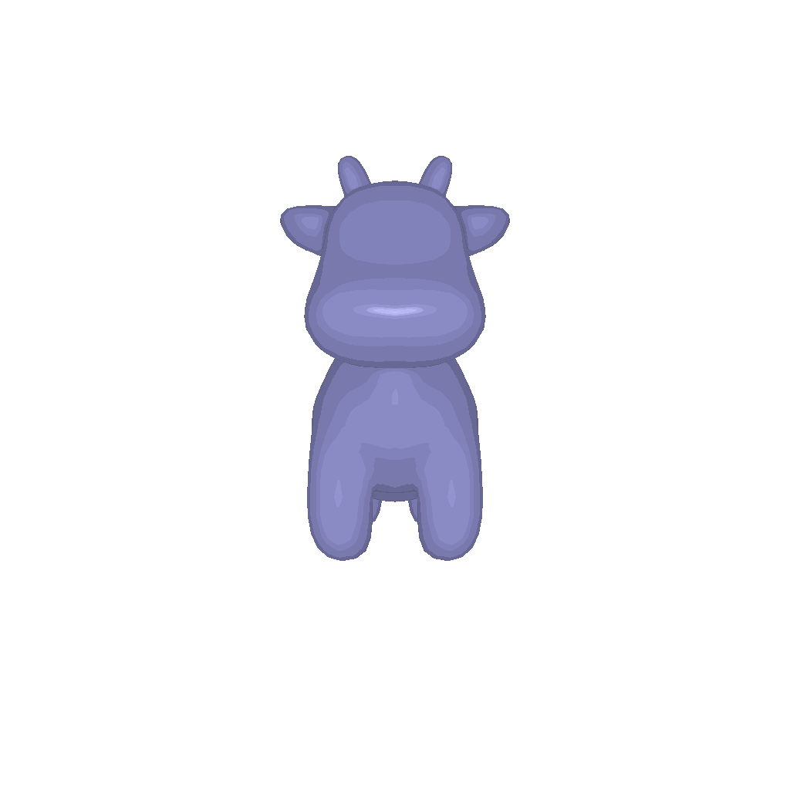

## 1.2 Re-creating the Dolly Zoom

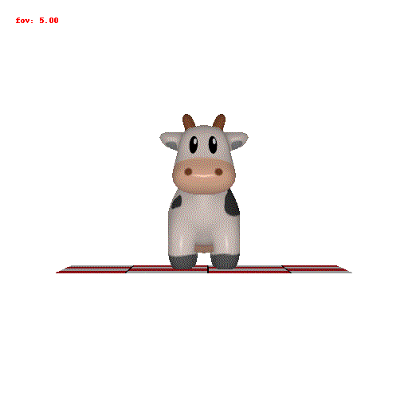

# 2. Practicing with Meshes

## 2.1 Constructing a Tetrahedron

The tetrahedron needs to have 4 vertices and 4 faces

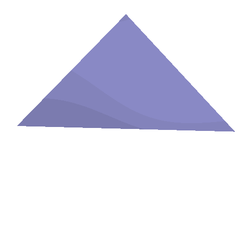

## 2.2 Constructing a Cube


# 3. Re-texturing a mesh

I choose the following colors:

- color1 = [0.0, 0.4, 0.6]
- color2=[0.6, 0.4, 0.0]

I honestly chose the color by random. 


# 4. Camera Transformations

I tried my best to mimic the views which were given in the writeup. The R_relative and t_relative
are **left multiplied** with the identity rotation and are therefore transformations of the camera
w.r.t to the fixed world frame.

**Further, ```R_final = R_relative @ R_initial```. This ```R_final``` will be the transform
that will finally take the camera frame to the world frame.**

## Transformations which match input images:

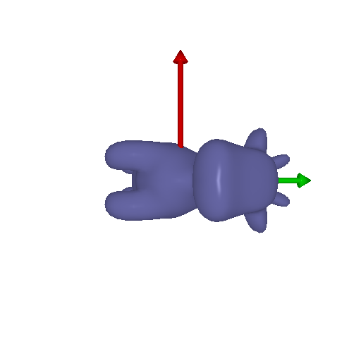
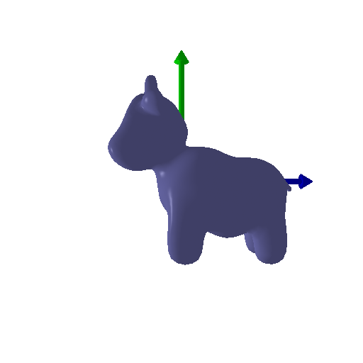
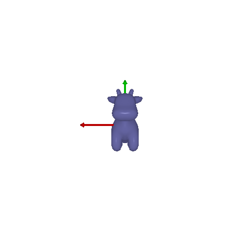
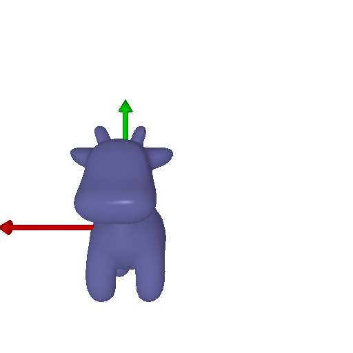


# 5. Rendering Generic 3D Representations

## 5.1 Rendering Point Clouds from RGB-D Images

|     First PointCloud                    |      Second PointCloud                |      Third PointCloud                    |
|:----------------------------------------|:--------------------------------------|:-----------------------------------------|
| 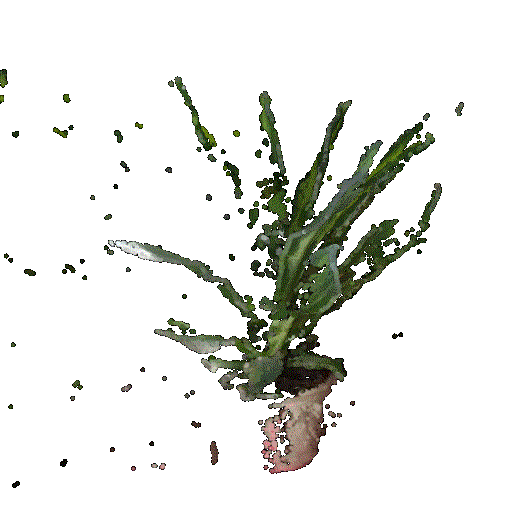    | 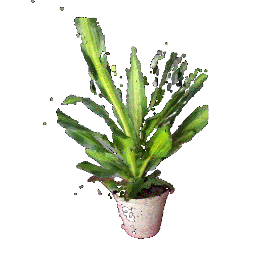 |  |


## 5.2 Parametric Functions

### Torus Pointcloud

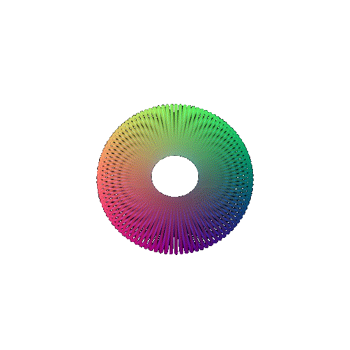

## HyperBolloid Pointcloud

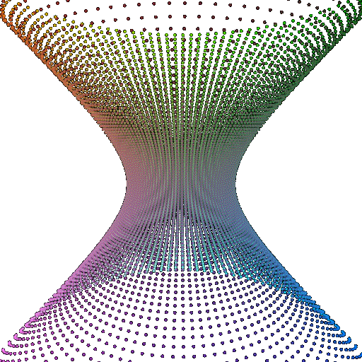

## 5.3 Implicit Surfaces

### Torus Implicit Surface


The tradeoffs in terms of speed and memory were compared **between pointcloud torus and the implicit torus**

- Memory occupied by torus_point_cloud in MB:  4.57763671875e-05
  Time taken to render parametric torus:  0.31734442710876465

- Memory occupied by mesh in MB:  4.57763671875e-05
  Time taken to render implicit torus:  2.4901247024536133

It can be seen while in memory both objects are comparable, it took much longer for the implicit surface to render

### Implicit Hyperbolloid

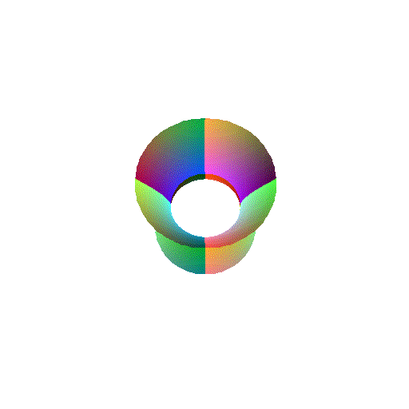

## 6. Do Something Fun

I found the model of the BB8 droid from Star Wars and tried to render the same. However,
the geometry was too complex and my computer struggled a bit. Nonetheless, here is a rendering:

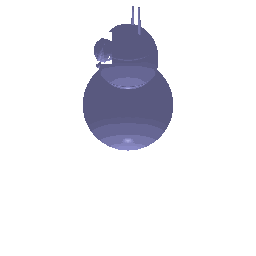